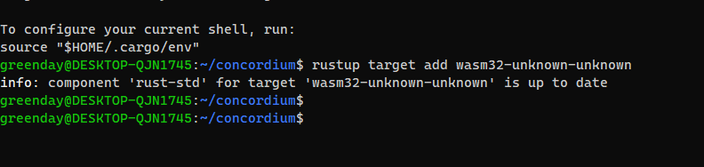
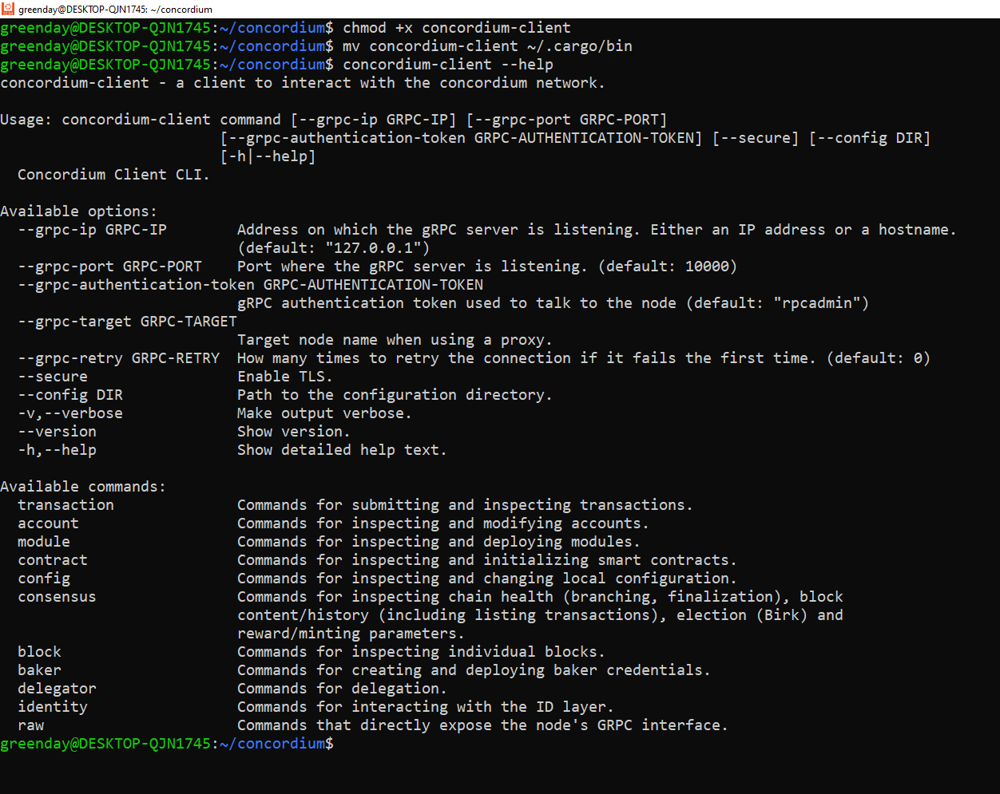

## Installing Rust


## Add Wasm


## Download, Install and move Concordium Package


- [x] Excexute Command

```
sudo chmod +x cargo-concordium && mv cargo-concordium ~/.cargo/bin
```

## Check If everything is correct
```
cargo concordium --help
```


## Install Concordium Client
- Download Package here https://developer.concordium.software/en/mainnet/net/installation/downloads-testnet.html#concordium-node-and-client-download-testnet
- Move the package to your path
- [x] Excexute Command
```
chmod +x concordium-client && mv concordium-client ~/.cargo/bin
```
- [x] Check If everything is correct
```
chmod +x concordium-client && mv concordium-client ~/.cargo/bin
```

```concordium-client --help
```


## Connect to the node (Test)
```
concordium-client consensus status --grpc-port 10000 --grpc-ip node.testnet.concordium.com
```

## Setup a wallet ( Install web wallet, Create Testnet Account and Acquiring testnet CCD via the CCD faucet )
- [x] Link For Download wallet: https://chrome.google.com/webstore/detail/concordium-wallet/mnnkpffndmickbiakofclnpoiajlegmg?hl=en-US
- [x] Request CCD


- [x] Export Account
```
concordium-client config account import 4HNkBQjhqGxbMEyKgTSCZRaHsW9dqqqvKtmYCSumPMHqq3horY.export --name MyName
```


